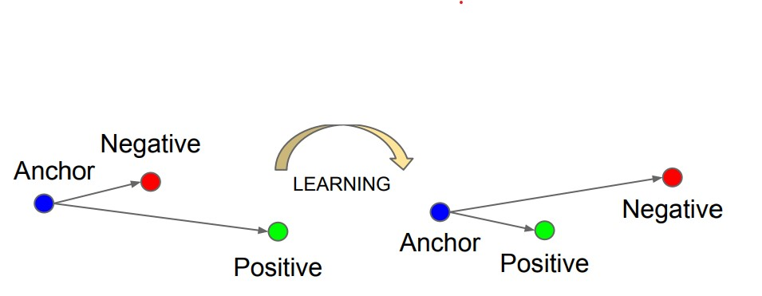

# siamese_network_generator

## Notice

This is now an [OPEN Open Source](http://openopensource.org/) project. This python library contains the definition of a Siamese Network, ready to use for image predictions.

## Contents

* [Introduction](#introduction)
* [Usage](#usage)
* [Getting Started](#getting-started)
* [Examples](#examples)

## Introduction


I used as base model a ResNet50 model pretrained on ImageNet and connected three more dense layers with 512 neurons on the first one and 256 on the last two. I set the target shape of input to (200,200,3). This model is designed to generate embedding for images, so I set the trainable attribute to true only for the layers that belonged to the last convolution block of the ResNet architecture, and freeze the other layers. This setup resulted in 60,510,720 Trainable params and 14,657,920 non-trainable params. Hereinafter we will call this model the Embedding Model and will note the embedding of an input image A with f(A).

Having the Embedding Model, I defined the Siamese Network which receives a triplet of images formed from an anchor, a positive and a negative, generates the
embeddings and returns two distances: between the anchor and the positive embeddings, and between the anchor and the negative embeddings. The anchor and the positive being the same class of images and the negative a different one. To compute those distances, I used a custom layer class named DistanceLayer, and for the distance formula we used the Squared Euclidian Distance:

<p align="center">
    d^2(p, q) = (p1 − q1)^2 + (p2 − q2)^2 + ... + (pn − qn)^2
</p>

Also represented as:

<p align="center">
  d^2(p, q) = ||p − q||^2
</p>

The final step was to define the Siamese Model with a custom training and testing loop. This model used the Siamese Network to compute the Triplet Loss Function:

<p align="center">
  L(A, P, N) = max(||f(A) − F(P)||^2 − ||f(A) − f(N)||^2 + margin, 0)
</p>

Where ’margin’ represent the actual margin that is enforced between positive and negative pairs. This loss function is used to ensure that an image A (anchor) is closer to all other images P (positive) of the same class than it is to any image N (negative). A visual representation of the effect of this function is the following image



Now the Siamese Network is ready for training. To test the results of the network, I generated the embedding of all the images from the training set, then I took all the test images one by one, generated an embedding and find the closest matching embedding from the training set. For the training of such a model, it is required to
select triplets of anchor, positive and negative images.

## Usage

Given a dataset of images from multiple classes. Each class must contain one or more images. This library can be used to train a model to recognize the class of a new image by selecting the closest match from the initial dataset.

## Getting started

In order to use the presented model, the user is required to have already installed Python 3.5 or higher.

There are two ways to use the library:
1. Download the repository and copy the files in a python project
2. Download and install the compressed python library: Download the file located at dist/siamese_network_generator-0.1.0-py3-none-any.whl in this repository, then in your python project you can run the following comand (replacing "/path/to" with your actual path):

```bash
$ pip install /path/to/siamese_network_generator-0.1.0-py3-none-any.whl
```

Once you have installed your Python library, you can import it using:
```bash
import siamese_network_generator
from siamese_network_generator import simese_network_actions
```

For both ways, you need to install the some dependencies for the library to run properly. You can easily install these dependencies using PIP, but note that they might take some time. Note to update PIP before using the following commands:

```bash
pip install tensorflow==2.5
pip install pandas
pip install keras

```

You can also run this library using Anaconda, to train the model with your gpu. For this case, you will need to run the following commands in your environment:
```bash
conda install -c conda-forge tensorflow==2.5
conda install pandas
conda install -c conda-forge keras

```


## Examples

To ilustrate an example a simple usage of this library is presented in the test folder.

Here, 

